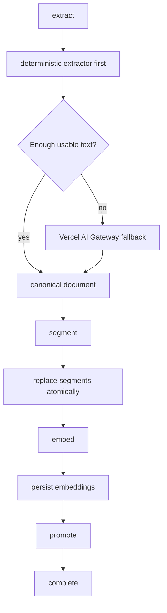
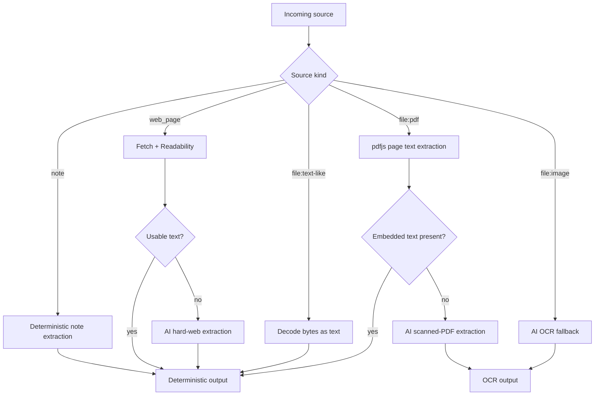

# Ingestion Workflow Foundation

`LAB-120` establishes the first source-aware extraction and chunking workflow
for Memory Vault.

This document describes what the ingestion workflow can process right now, how
the stages fit together, and where AI fallback is intentionally used.

## What The Workflow Does Now

The workflow now accepts the three v1 source kinds already entering the app:

- `note`
- `web_page`
- `file`

It extracts canonical text, chunks that text into ordered `segments`, persists
provenance-rich segment rows, generates embeddings for those text segments, and
advances the job through the remaining placeholder stages needed by the broader
ingestion pipeline.

It still does **not** perform retrieval fusion, reranking, or memory promotion.

## End-To-End Shape

```mermaid
flowchart LR
    A["User creates capture or upload"] --> B["source_items / source_blobs"]
    B --> C["ingestion_jobs row queued"]
    C --> D["Inngest worker starts job"]
    D --> E["extract stage"]
    E --> F["canonical extracted document"]
    F --> G["segment stage"]
    G --> H["segments persisted with provenance"]
    H --> I["embed stage"]
    I --> J["segment embeddings persisted"]
    J --> K["job marked complete"]
```

## Current Stage Semantics

## What You Can Process Through This Workflow

### Notes

- Plain text note captures stored on `source_items.metadata.noteBody`
- Paragraph structure is preserved before chunking
- Output segment kind is `plain_text`

### Web Pages

- Submitted URLs that resolve to HTML pages
- Readable article-like pages extracted with `@mozilla/readability`
- Hard pages that need AI cleanup via Vercel AI Gateway
- Non-HTML URLs that actually return a supported file type, such as text or PDF

Current web-page behavior:

- server-side fetch with redirect following
- final response URL becomes canonical URI
- deterministic readability extraction first
- AI fallback when readability fails or text yield is too low

### Files

Currently supported file inputs:

- `text/plain`
- `text/markdown`
- `application/json`
- `application/pdf`
- `image/png`
- `image/jpeg`
- `image/webp`
- `image/gif`

Current file behavior:

- text-like files are decoded directly
- PDFs use deterministic `pdfjs-dist` extraction first
- scanned/no-text PDFs fall back to AI OCR
- images go directly to AI OCR

Unsupported file types fail explicitly instead of being guessed.

## Deterministic vs AI Fallback

## Current AI Boundary

The app uses a shared server-only AI integration in
`apps/web/src/lib/ai/extraction.ts`.

Current policy:

- AI SDK v6 through Vercel AI Gateway
- Google-first routing
- OCR / scanned PDF / image fallback:
  - primary: `google/gemini-3-flash`
  - fallback chain: `openai/gpt-5-mini`, `anthropic/claude-sonnet-4.6`
- hard web-page fallback:
  - primary: `google/gemini-3.1-pro-preview`
  - fallback chain: `openai/gpt-5`, `anthropic/claude-sonnet-4.6`

AI is used for extraction, normalization, and segment embeddings only, not
summarization or memory synthesis.

Current embedding policy:

- `google/gemini-embedding-2` through Vercel AI Gateway
- stored dimension remains `1536`
- retrieval units are still text `segments`, even though the embedding model can
  accept multimodal inputs for future work

## Canonical Output Shape

Extraction produces one canonical document with:

- normalized full text
- optional title
- optional language code
- canonical URI
- MIME type
- ordered blocks with source-aware metadata

Segmentation then persists ordered rows with:

- `ordinal`
- `kind`
- `content`
- `contentHash`
- `tokenCount`
- `charStart`
- `charEnd`
- `sourceBlobId`
- provenance metadata such as source URI, MIME type, extractor, fallback usage,
  model route, and page numbers when available

## Current Chunking Policy

- Target chunk length is about 900 characters
- Very small chunks under about 300 characters are merged when appropriate
- Hard maximum is about 1400 characters
- Oversized blocks split on sentence boundaries first, then whitespace-safe
  wraps
- Source order is preserved
- Note paragraphs remain separate segments in the current v1 behavior

## What This Workflow Does Not Do Yet

- DOCX extraction
- audio extraction
- video extraction
- retrieval ranking
- memory synthesis or promotion logic beyond stage placeholders

Those remain later tickets even though the ingestion pipeline is now ready to
hand off embedded text segments to them.

## Operational Verification

Use these commands when changing the workflow:

- `pnpm --filter web test`
- `pnpm --filter web build`
- `pnpm check:ci`
- `pnpm qc`

Run evals too when prompts, model routing, or fallback behavior changes:

- `pnpm --filter web evals`
